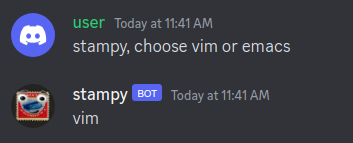
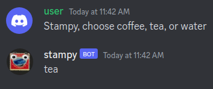

# Overview

This document details how to implement a new feature for Stampy, by creating a module - Stampy is organized into modules, which inherit from the `Module` class.

To explain how to implement a new Stampy feature, let's work through an example: Choosing randomly between options. The goal is a feature that works like this:

Example 1



Example 2



# Module Creation Steps

We'll implement this by creating a new module, which we'll call the 'choose' module. Here's how you'd do that!

1. Open a GitHub issue that describes the module that you're planning to make.
1. Message the [`#stampy-dev` channel on Discord](https://discord.com/channels/677546901339504640/758062805810282526), to get feedback and buy-in for your potential module. If the general idea seems well liked, assign it to yourself and start coding.
1. Create a new branch named similarly to your module. `$ git checkout -b choose-module`
1. Create a new file named after your module inside of [the `modules` folder](https://github.com/robertskmiles/stampy/tree/master/modules). `$ <editor of your choice> choose.py`
1. Inside of `choose.py`, create a child class of the `Module` class
    - ```python
        import re
        from random import choice
        from modules.module import Module, Response


        class ChooseModule(Module):
            def __str__(self):
                return "Choose Module"
        ```
1. Implement the required functions from the `Module` parent class
    - [`process_message(self, message)`](https://github.com/robertskmiles/stampy/blob/master/modules/module.py#L95)
        - This method takes a message and processes it, optionally returning a reply for Stampy to say, and an integer representing its confidence that the reply is good and should be posted. This method usually contains the core functionality of our module.
        - ```python
            def process_message(self, message):
                text = self.is_at_me(message)
                if text and text.startswith("choose ") and " or " in text:
                    choices_string = text.partition(" ")[2].strip("?")
                    options = [option.strip() for option in re.split(" or |,", choices_string) if option.strip()]
                    return Response(
                        confidence=8, 
                        text=choice(options), 
                        why="I was asked to make a choice"
                    )
                return Response()
            ```
        - `self.is_at_me(message)` checks if the message addressed to Stampy, for example by starting or ending with "stampy". If so, it returns the text of the message stripped of the address to stampy, otherwise it returns None. Checking this is usually a good idea, since we generally don't want Stampy to butt in on existing conversations.
          - Examples of outputs from `self.is_at_me(message)`:
            -  `"Hello"` -> `None`
            -  `"Hello stampy"` -> `"Hello"`
            -  `"What do you mean, stampy?"` -> `"What do you mean?"`
        - All modules return a [response object](https://github.com/robertskmiles/stampy/blob/master/modules/module.py#L95). This object should contain a text response to send directly to the user in the `text` property. If a developer needs to utilize more complex functionality they can instead provide the response object with a function to run in the future via the `callback` property ([see the response object doc string for more info](https://github.com/robertskmiles/stampy/blob/master/modules/module.py#L95)). If the message isn't addressed to stampy or our module, we return an empty Response object which by default has 0 confidence. If the message is addressed to stampy and looks like a choice question addressed to stampy, we return 8 ("This is a valid command specifically for this module")
        - Multiple modules might think that they could respond to a message. The system will take whichever module reports the highest confidence from `process_message` via the response object.
        - The last thing we need to do is to write a few test cases to verify that the module we wrote works correctly. For this we will use stampy's test module which is built in to the module base class. Simply define test cases as a list property of the class:
        - ```python
            @property
            def test_cases(self):
                return [
                    self.create_integration_test(question="choose A or B", expected_regex=r"(^A$)|(^B$)"),
                    self.create_integration_test(
                        question="choose one, two, or three", expected_regex=r"(^one$)|(^two$)|(^three$)"
                    ),
                ]
            ```
        - Notice that we are using regular expressions in this case to match the expected response. Fuzzy matching is also supported by `create_integration_test` using the `expected_response` (expected text) and `minimum_allowed_similarity` (number between 0 and 1 representing the percentage of matching chars).
    - The final `choose.py` module file might look like this:
    ```python
    import re
    from random import choice
    from modules.module import Module, Response
    
    
    class ChooseModule(Module):
        def __str__(self):
            return "Choose Module"
    
        def process_message(self, message):
            text = self.is_at_me(message)
            if text and text.startswith("choose ") and " or " in text:
                choices_string = text.partition(" ")[2].strip("?")
                options = [option.strip() for option in re.split(" or |,", choices_string) if option.strip()]
                return Response(confidence=8, text=choice(options), why="I was asked to make a choice")
            return Response()
    
        @property
        def test_cases(self):
            return [
                self.create_integration_test(question="choose vim or emacs", expected_regex=r"(^vim$)|(^emacs$)"),
                self.create_integration_test(
                    question="choose coffee, tea, or water", expected_regex=r"(^coffee$)|(^tea$)|(^water$)"
                ),
            ]
    ```
2. Stampy will automatically load your module using the [`get_stampy_modules` function](stam.py#L18), which imports everything from `modules`, detects classes that inherit from `Module`, instantiates them and appends to `modules_dict`.
   1. Previously it was required to add modules manually to the dictionary. This method is admittedly hacky but it's also convenient and not very likely to backfire.
3. Once your feature is implemented, test your changes on the [test discord server](https://discord.com/channels/783123903382814720/783123903382814723). You can run your integration test by asking stampy `stampy test yourself` in a discord channel where stampy is listening. Your output should be visible on discord.
5. Add and commit your changes
    - `git add modules/choose.py stam.py`
    - `git commit -m "Created a new stampy module that randomly chooses between options given by the user"`
6. [Open a pull request](https://docs.github.com/en/github/collaborating-with-issues-and-pull-requests/creating-a-pull-request) on [github](https://github.com/robertskmiles/stampy/pulls)
7. Post a link to your pull request in the [`#stampy-dev` Discord channel](https://discord.com/channels/677546901339504640/758062805810282526)

Good job, thanks for helping make Stampy better!
